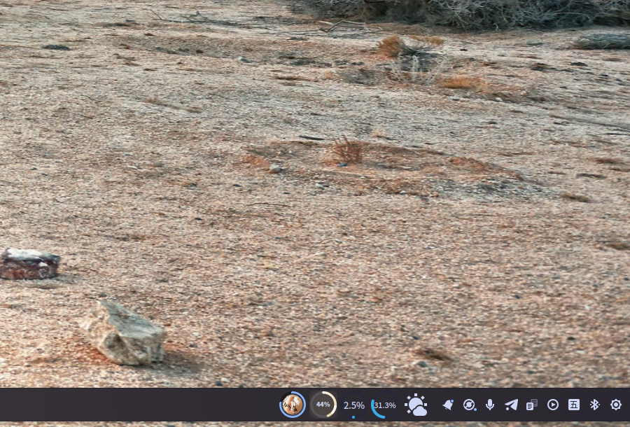
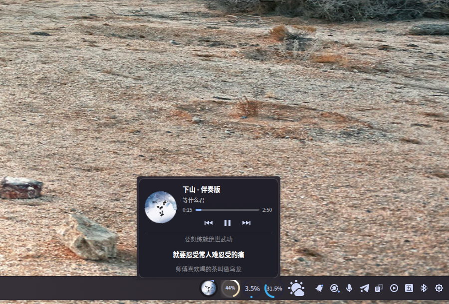
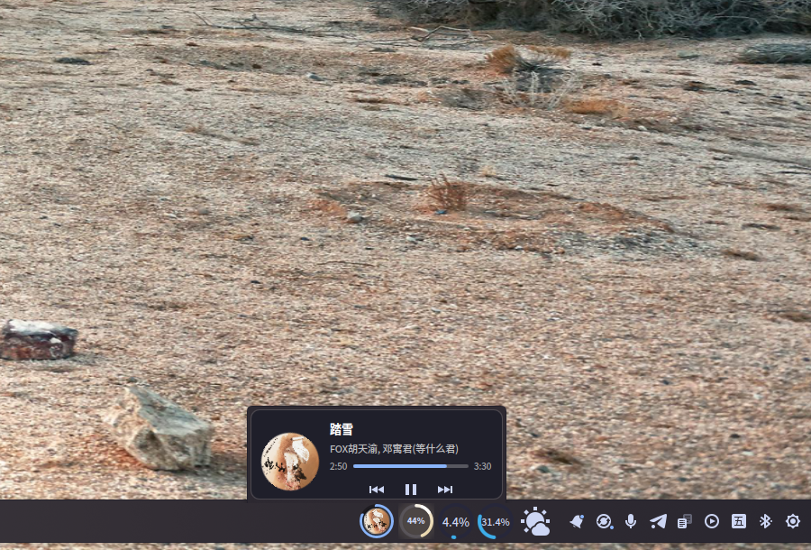
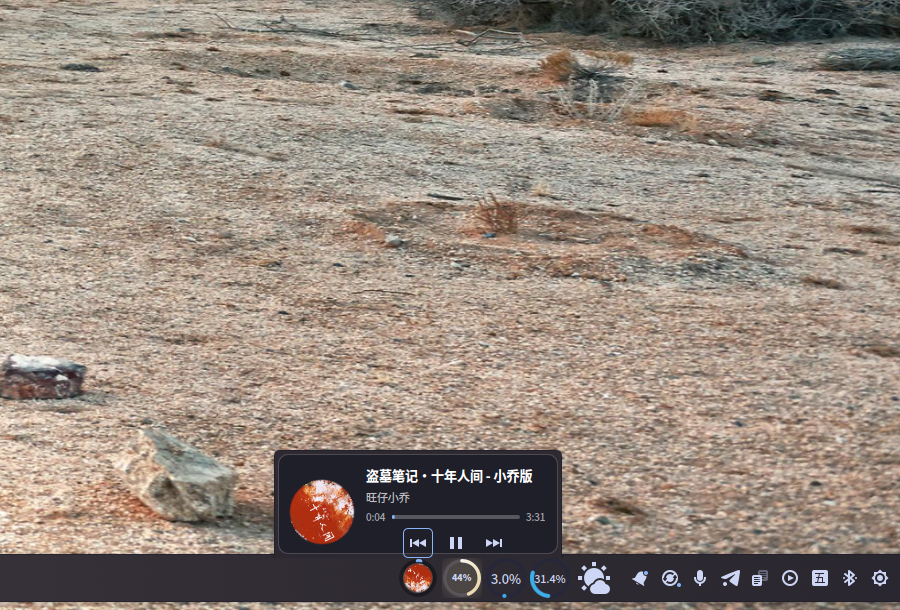

# 💿 Medi Circle

**A circular MPRIS music player for your Plasma 6 taskbar.**

Your album art becomes a spinning vinyl record with a real-time progress ring. Hover to control playback, double-click to raise your player, and read synced lyrics right in the panel.


*Medi Circle on the desktop — the record icon with its hover popup*

## ✨ Features

- **🎵 Spinning record icon** — album art is circularly cropped and rotates like a vinyl record while playing (3200 ms per rotation)
- **⭕ Progress ring** — a Canvas-drawn ring around the record edge shows playback progress in real time
- **🖱️ Hover popup** — track title, artist, seek bar with elapsed time, and previous / play–pause / next controls
- **👆 Double-click to raise** — double-click the popup's blank area to focus (raise) your media player window
- **📜 Synced lyrics** — fetched automatically from [lrclib.net](https://lrclib.net); displayed in a smooth 3-line fade with the current line highlighted
- **📏 Auto-collapsing popup** — the popup is 100 px tall without lyrics and grows to 200 px when lyrics are available
- **🎧 Spotify-style placeholder** — shown when nothing is playing
- **🔄 MPRIS2 standard** — works with virtually any MPRIS2-compatible player


*The spinning record icon sitting in the taskbar*


*Popup with synced lyrics — current line highlighted, previous/next fading out*


*Compact popup when the current track has no lyrics*


*Another compact popup — different track, different playback progress*

## 📦 Requirements

- **KDE Plasma 6** (6.0 or later)
- **Qt 6** (Quick / Quick Controls 2)
- A media player with **MPRIS2** support (Spotify, mpv, VLC, Strawberry, MPD, Firefox/Chrome media, KDE's Elisa, …)
- Internet access for lyrics (lrclib.net)

## 🛠️ Installation

### From source

```bash
git clone https://github.com/MX10085/mediacircle.git
cd mediacircle
plasmapkg2 --install mediacircle-v1.0.0.tar.gz
```

### Manual

```bash
# extract into your local plasmoids directory
tar -xzf mediacircle-v1.0.0.tar.gz -C ~/.local/share/plasma/plasmoids/

# restart Plasma shell so the new widget is picked up
plasmashell --replace
```

Then right-click your panel → **Add Widgets** → search **Medi Circle** → drag it onto the panel.

> Tip: place it next to the system tray for the classic music-widget look.

## 🎮 Usage

| Action | Result |
|---|---|
| **Hover** the record icon | Opens the player popup above the icon |
| **Click** play/pause button | Toggles playback |
| **Click** previous / next | Skips track |
| **Double-click** popup blank area | Raises (focuses) the media player window |
| Play a song with lyrics | Lyrics appear automatically in the popup |

## 🎤 About the lyrics

Medi Circle queries **lrclib.net** for synced lyrics using the current track and artist name.
If a match is found, the popup expands and shows **3 lines** with a fade effect:

- the **current line** is highlighted
- the **previous and next lines** fade in/out around it

If the song has no lyrics on lrclib.net, the popup stays compact (no lyrics section).

## 🔧 Compatibility

Built with the Plasma **Mpris2Model**, so it works with any MPRIS2-compatible player:

- Spotify (official client & web player)
- mpv / mpd / cmus (via mpris plugin)
- VLC, Strawberry, Elisa, Audacious
- Firefox / Chromium media sessions
- …and anything else speaking MPRIS2

Tested on **Plasma 6.x, Wayland** (X11 should work as well).

## 📁 Project layout

```
mediacircle/
└── contents/
    └── ui/
        ├── main.qml        # Plasmoid root: MPRIS model, lyrics fetch, popup logic
        ├── Compact.qml     # Taskbar icon: progress ring + spinning record
        └── FullPanel.qml   # Popup: track info, controls, lyrics list
```

## 📄 License

**GPL-3.0** — free to use, modify, and share.
